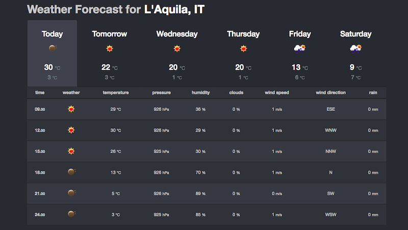
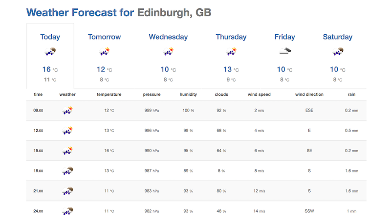

This web application displays the weather forecast for a given location.

## Initial Machine Setup
1. **Install [Node 4.0.0 or greater](https://nodejs.org)** - (5.0 or greater is recommended for optimal build performance). Need to run multiple versions of Node? Use [nvm](https://github.com/creationix/nvm).
2. **Install [Git](https://git-scm.com/downloads)**. 
3. **[Disable safe write in your editor](http://webpack.github.io/docs/webpack-dev-server.html#working-with-editors-ides-supporting-safe-write)** to assure hot reloading works properly.
4. On a Mac? You're all set. If you're on Linux or Windows, complete the steps for your OS below.  
 
**On Linux:**  

 * Run this to [increase the limit](http://stackoverflow.com/questions/16748737/grunt-watch-error-waiting-fatal-error-watch-enospc) on the number of files Linux will watch. [Here's why](https://github.com/coryhouse/react-slingshot/issues/6).    
`echo fs.inotify.max_user_watches=524288 | sudo tee -a /etc/sysctl.conf && sudo sysctl -p` 

**On Windows:** 
 
* **Install [Python 2.7](https://www.python.org/downloads/)**. Some node modules may rely on node-gyp, which requires Python on Windows.
* **Install C++ Compiler**. Browser-sync requires a C++ compiler on Windows. [Visual Studio Express](https://www.visualstudio.com/en-US/products/visual-studio-express-vs) comes bundled with a free C++ compiler. Or, if you already have Visual Studio installed: Open Visual Studio and go to File -> New -> Project -> Visual C++ -> Install Visual C++ Tools for Windows Desktop. The C++ compiler is used to compile browser-sync (and perhaps other Node modules).

## Get an API Key

Before getting started, go to [OpenWeatherMap](http://openweathermap.org) to register for a free account and get an API key. 

Later you will need to put the key in `src/constants/api.js`.

## Get Started

1. **Clone the project**. `git clone https://github.com/stedice/weather-web-app.git`.
2. **Run the setup script**. `npm install`
3. **Insert the API key** that you got from [OpenWeatherMap](http://openweathermap.org) in `src/constants/api.js`
4. **Run the app**. `npm start -s` 

This will run the automated build process, start up a webserver listening on `localhost:3000` and open the application in your default browser. When doing development with this kit, this command will continue watching all your files. Every time you hit save the code is rebuilt, linting runs, and tests run automatically. Note: The -s flag is optional. It enables silent mode which suppresses unnecessary messages during the build.

To **Run a production build**. `npm run build`

## Features

* Enter city name to get 5 days weather forecast.
* City name is searched in the API and if not found the closest value is returned.
* Daily summary of weather and minimum/maximum temperatures is displayed.
* Select day to get detailed 3 hourly forecast.
* Detailed Daily forecast includes the following:
  * An icon for weather conditions,
  * Air temperature in Celsius degrees,
  * Atmospheric pressure on the sea level in hPa,
  * Relative humidity percentage,
  * Cloudiness in percentage,
  * Wind speed in m/s,
  * Wind direction using compass coordinates,
  * Aggregate rainfall volume for last 3 hours.

## Future Improvements

* Include more unit tests.
* Create an express http proxy server to hide API key in frontend and
* include a JWT (JSON Web Token) to authenticate requests.
* Include a backend stub for offline testing.
* Make use of more React/Redux additional tools es:
	* `react-bootstrap` for better code readability and faster developing using reusable components
	* `react-router` to create a "Settings" and an "About" pages
* Use more dev-tools.
* Improve responsiveness.
* Change dynamically [Bootswatch](https://bootswatch.com/) theme.
* Create local icon library es. [WeatherIcons](https://erikflowers.github.io/weather-icons/).
* Switch between imperial/metric unit systems.
* Internationalization / Localization.

## Technologies

This app uses [React Slingshot](https://github.com/coryhouse/react-slingshot), a comprehensive starter kit for rapid application development using React.

Slingshot offers a rich development experience using the following technologies:

| **Tech** | **Description** |**Learn More**|
|----------|-------|---|
|  [React](https://facebook.github.io/react/)  |   Fast, composable client-side components.    | [Pluralsight Course](https://www.pluralsight.com/courses/react-flux-building-applications)  |
|  [Redux](http://redux.js.org) |  Enforces unidirectional data flows and immutable, hot reloadable store. Supports time-travel debugging. Lean alternative to [Facebook's Flux](https://facebook.github.io/flux/docs/overview.html).| [Getting Started with Redux](https://egghead.io/courses/getting-started-with-redux), [Building React Applications with Idiomatic Redux](https://egghead.io/courses/building-react-applications-with-idiomatic-redux), [Pluralsight Course](http://www.pluralsight.com/courses/react-redux-react-router-es6)|
|  [React Router](https://github.com/reactjs/react-router) | A complete routing library for React | [Pluralsight Course](https://www.pluralsight.com/courses/react-flux-building-applications) |
|  [Babel](http://babeljs.io) |  Compiles ES6 to ES5. Enjoy the new version of JavaScript today.     | [ES6 REPL](https://babeljs.io/repl/), [ES6 vs ES5](http://es6-features.org), [ES6 Katas](http://es6katas.org), [Pluralsight course](https://www.pluralsight.com/courses/javascript-fundamentals-es6)    |
| [Webpack](http://webpack.github.io) | Bundles npm packages and our JS into a single file. Includes hot reloading via [react-transform-hmr](https://www.npmjs.com/package/react-transform-hmr). | [Quick Webpack How-to](https://github.com/petehunt/webpack-howto) [Pluralsight Course](https://www.pluralsight.com/courses/webpack-fundamentals)|
| [Browsersync](https://www.browsersync.io/) | Lightweight development HTTP server that supports synchronized testing and debugging on multiple devices. | [Intro vid](https://www.youtube.com/watch?time_continue=1&v=heNWfzc7ufQ)|
| [Jest](https://facebook.github.io/jest/) | Automated tests with built-in expect assertions and [Enzyme](https://github.com/airbnb/enzyme) for DOM testing without a browser using Node. | [Pluralsight Course](https://www.pluralsight.com/courses/testing-javascript) |
| [TrackJS](https://trackjs.com/) | JavaScript error tracking. | [Free trial](https://my.trackjs.com/signup)|  
| [ESLint](http://eslint.org/)| Lint JS. Reports syntax and style issues. Using [eslint-plugin-react](https://github.com/yannickcr/eslint-plugin-react) for additional React specific linting rules. | |
| [SASS](http://sass-lang.com/) | Compiled CSS styles with variables, functions, and more. | [Pluralsight Course](https://www.pluralsight.com/courses/better-css)|
| [PostCSS](https://github.com/postcss/postcss) | Transform styles with JS plugins. Used to autoprefix CSS |
| [Editor Config](http://editorconfig.org) | Enforce consistent editor settings (spaces vs tabs, etc). | [IDE Plugins](http://editorconfig.org/#download) |
| [npm Scripts](https://docs.npmjs.com/misc/scripts)| Glues all this together in a handy automated build. | [Pluralsight course](https://www.pluralsight.com/courses/npm-build-tool-introduction), [Why not Gulp?](https://medium.com/@housecor/why-i-left-gulp-and-grunt-for-npm-scripts-3d6853dd22b8#.vtaziro8n)  |
